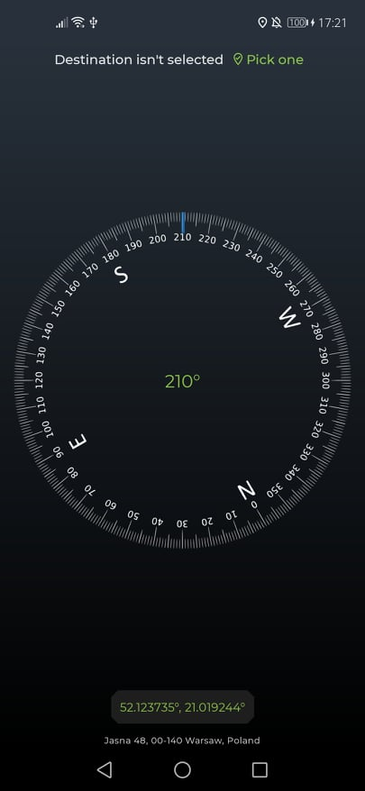
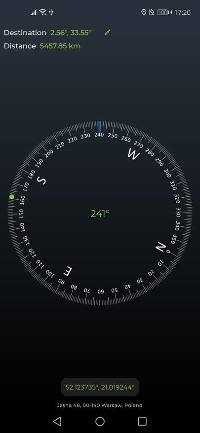
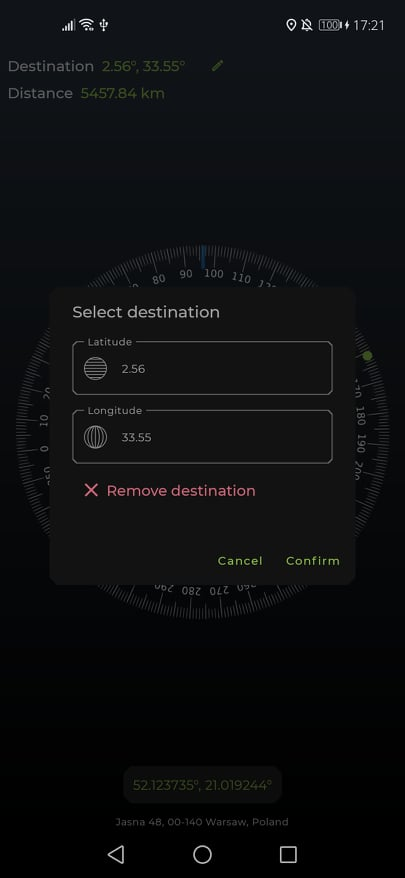
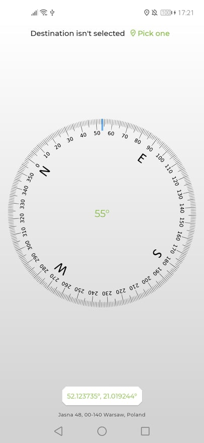
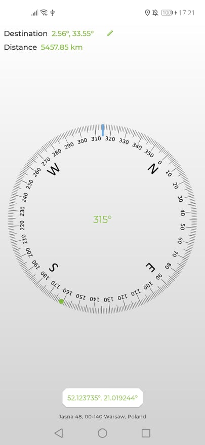
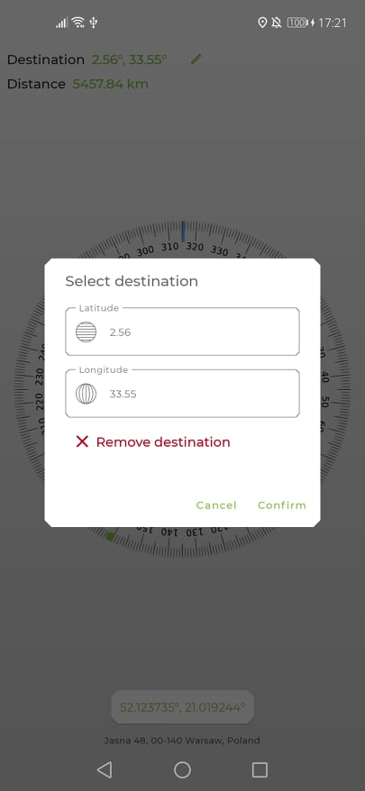

# Compass
Compass app build in Android/Kotlin/Jetpack Compose

The app allows navigating to the selected destination. The destination is selected by giving coordinates to it.

</img>
</img>
</img>

</img>
</img>
</img>

###### Bugs
###### Retrieved azimuth changes too fast in an irregular way so the compass sometimes shakes weirdly.
